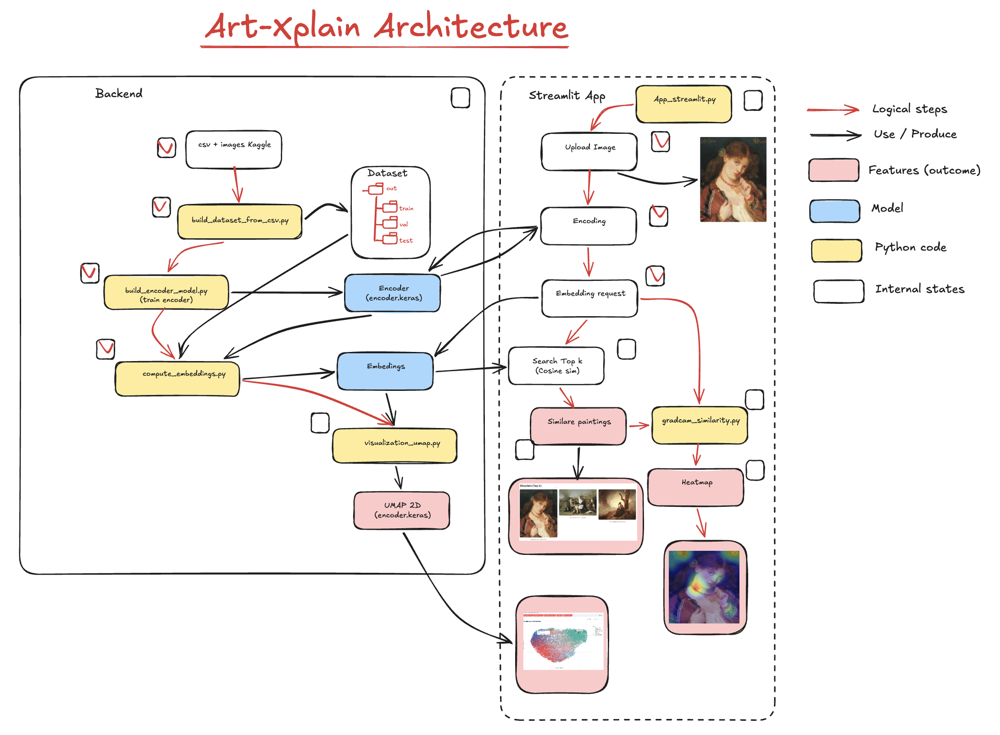
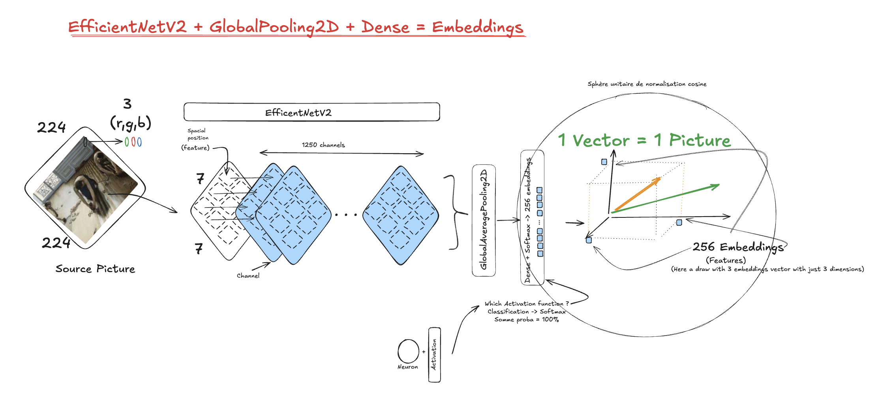

<h1 align="center">Art-Xplain</h2>
<h3 align="center">Moteur de similarité stylistique pour oeuvres peintes</h2>


---
_v 0.03.20.1214_
- **Emmanuelle** - _manievfoulards@gmail.com_
- **Lucile** - _lucilejosse.mail@gmail.com_
- **Lionel** - _lion94.home@gmail.com_

Art-Xplain est un projet Python/TensorFlow qui apprend un encodeur visuel pour comparer des œuvres d'art par similarité de style.

Le pipeline couvre:
- préparation d'un dataset Keras-ready (train/val/test)
- entraînement d'un model encodeur
- recherche top-k par similarité cosinus
- explication visuelle de similarité avec Grad-CAM
- démo interactive Streamlit
## Architecture




## 1) Structure des données

Entrée (dataset Kaggle source):
- `data/in/kaggle-wikiart`

Sortie (dataset généré pour entraînement):
- `data/out/train/<style>/*.jpg`
- `data/out/val/<style>/*.jpg`
- `data/out/test/<style>/*.jpg`

Ces chemins sont configurés dans `config.yaml` via:
- `paths.kaggle_root: data/in/kaggle-wikiart`
- `paths.keras_root: data/out`

## 2) Installation

```bash
pyenv virtualenv art-xplain
cd art-xplain
pyenv local art-xplain
pip install -r requirements.txt
```

## 3) Pipeline complet

### Étape 1 — Construire les splits train/val/test

  - #### Option notebook:

```bash
# Open this notebook:
art-xplain/art-xplain/notebooks/step_1_build_dataset_step_by_step.ipynb
```

  - #### Option python:

```bash
python -m src.build_dataset_from_csv
```

Options utiles:
- Nettoyer `data/out` puis régénérer:

```bash
python -m src.build_dataset_from_csv --clean-out
```

- Nettoyer uniquement `data/out`:

```bash
python -m src.build_dataset_from_csv --clean-only
```

### Étape 2 — Entraîner l'encodeur

  - #### Option notebook:

```bash
# Open this notebook:
art-xplain/art-xplain/notebooks/step_2_train_encoder_step_by_step.ipynb
```

  - #### Option python:

```bash
python -m src.train_encoder_model
```

### Étape 3 — Calculer les embeddings

  - #### Option notebook:

```bash
# Open this notebook:
art-xplain/art-xplain/notebooks/step_3_compute_embeddings_step_by_step.ipynb
```

 - #### Option python:

```bash
python -m src.compute_embeddings
```

Fichiers générés dans `embeddings/`:
- `vectors.npy`
- `labels.npy`
- `filenames.npy`
- `classnames.npy`

### Étape 4 — Projeter en 2D (UMAP)

```bash
cd art-xplain/art_xplain
python -m src.visualization_umap
```

Fichier généré:
- `latent_2d.npy`

### Étape 5 — Lancer l'application Streamlit

```bash
cd art-xplain/art_xplain
streamlit run src/app_streamlit.py
```

## 5) Notebook de préparation

Définition (materialization): dans ce projet, la materialization correspond à la copie physique des images vers l’arborescence cible `data/out/train|val|test/<style>/...` à partir des splits calculés.

Le notebook étape 1 permet de travailler, tester, comprendre et valider la préparation du dataset labelisé pour entrainer du model:
- `notebooks/step_1_build_dataset_step_by_step.ipynb`

Le notebook `step_1_build_dataset_step_by_step.ipynb` exécute les opérations lecture CSV, préparation labels, filtrage, split, nettoyage, matérialisation.

Les fonctions `detect_images_root_from_filenames`, `infer_label_from_filename_parent`, `normalize_label_value`, `clean_output_root` et `materialize_split` sont elles codées dans `src/build_dataset_from_csv.py`. Le notebook permet d’exécuter ces opérations de base pas à pas.

### Résumé des cellules du notebook

- Cellules 1-2: imports, détection de la racine projet, chargement de la config.
- Cellule 3: lecture du CSV et inspection des colonnes.
- Cellule 4: préparation de `filename` + `label` (inférence/normalisation).
- Cellule 5: détection du dossier images + filtrage des styles.
- Cellule 6: split stratifié `train/val/test`.
- Cellule 7: nettoyage optionnel de `data/out` (`clean_output_root`).
- Cellule 8: matérialisation optionnelle des splits (`materialize_split`).
- Cellule 9: vérification rapide du résultat (comptage styles/fichiers).

### Résumé des fonctions clés du notebook

- `detect_images_root_from_filenames`:
  teste plusieurs racines candidates et sélectionne celle qui résout le plus de chemins `filename` du CSV (ex: `kaggle_root`, `kaggle_root/images`, sous-dossiers).

- `infer_label_from_filename_parent`:
  essaie d'inférer le label depuis le dossier parent du `filename` (ex: `Impressionism/img.jpg` -> `Impressionism`), utile quand la colonne `style` n'est pas fiable ou absente.

- `normalize_label_value`:
  nettoie/normalise les labels (gestion des labels stockés comme listes texte, suppression d'ambiguïtés, remplacement de `/` par `_` pour créer des dossiers sûrs).

- `clean_output_root`:
  supprime le contenu de `paths.keras_root` (`data/out`) pour repartir d'un état propre avant une nouvelle génération.

- `materialize_split`:
  copie les images dans la structure finale `train/val/test/<style>/...` en résolvant les chemins sources et en comptant les fichiers copiés/manquants.

## 6) Build model notebook

Notebook:
- `notebooks/step_2_train_encoder_step_by_step.ipynb`

Résumé des cellules (étapes):
- Cellule 1-2: imports, détection de la racine projet.
- Cellule 3: chargement de la config et des chemins utiles.
- Cellule 4: vérification des dossiers `train` et `val`.
- Cellule 5: lecture des hyperparamètres du modèle et d'entraînement.
- Cellule 6: création des datasets TensorFlow.
- Cellule 7: construction de l'encodeur (backbone + embedding).
- Cellule 8: construction du classifieur (tête softmax).
- Cellule 9: callbacks + entraînement de la tête (phase 1).
- Cellule 10: fine-tuning optionnel (phase 2).
- Cellule 11: sauvegarde de l'encodeur.

## 7) Compute embeddings notebook

Notebook:
- `notebooks/step_3_compute_embeddings_step_by_step.ipynb`

Résumé des cellules (étapes):
- Cellule 1-2: imports, détection de la racine projet.
- Cellule 3: chargement de la config et des chemins utiles.
- Cellule 4: collecte des chemins d'images et labels.
- Cellule 5: création du dataset TensorFlow.
- Cellule 6: chargement de l'encodeur entraîné.
- Cellule 7: calcul des embeddings (batches).
- Cellule 8: sauvegarde des fichiers `.npy`.


## 7) Dépendances principales

- TensorFlow
- NumPy
- Pandas
- scikit-learn
- UMAP
- OpenCV
- Streamlit

## 8) Model: (description du modèle choisi)




### Description
**Étapes du modèle (encodeur + entraînement)**

- Entrée image:
    Une image est chargée et redimensionnée en img_size × img_size × 3.

- Prétraitement EfficientNetV2
    Normalisation/scale adaptée au backbone EfficientNetV2.

- Backbone EfficientNetV2B0
    Réseau convolutionnel pré-entraîné ImageNet (sans la tête finale).

- GlobalAveragePooling2D
    Agrège les cartes de features en un vecteur fixe.

- Dense (projection)
    Projection vers la dimension d’embedding embed_dim (ex: 256).

- UnitNormalization (L2)
    Normalise l’embedding sur la sphère unitaire pour la similarité cosinus.

- (Entraînement uniquement) Tête de classification
    Dense + softmax vers n_classes styles.
    - Deux phases:
        - Phase 1: entraînement de la tête (backbone gelé).
        - Phase 2 (optionnel): fine‑tuning des dernières couches du backbone.

- Usage
    - Retrieval: on garde l’embedding L2 pour comparer les images.
    - Grad‑CAM: visualisation des zones qui expliquent la similarité.

## 9) Notes

- Le script de build dataset est tolérant aux variations de format CSV et peut inférer le label depuis le dossier parent de `filename`.
