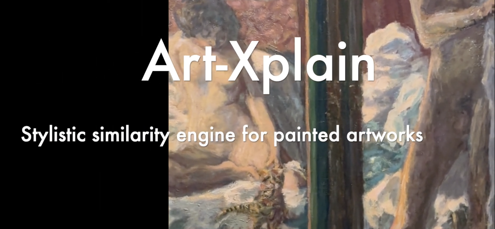
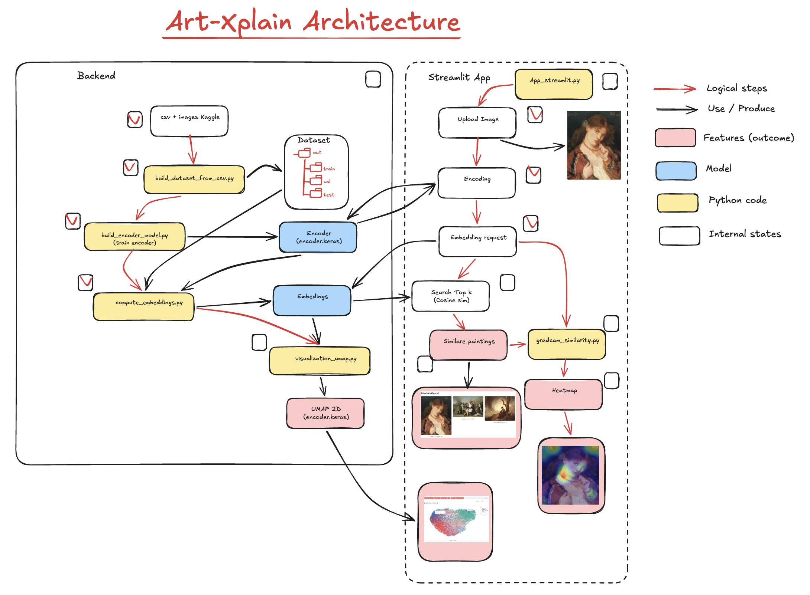
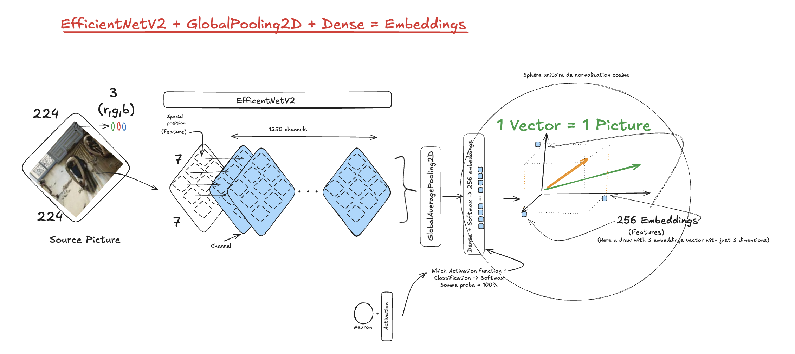

<p align="center">
  
</p>


---
_version 0.03.25.1710_
- **Lionel Natarianni**
- _Le Wagon teammates_
  - **Emmanuelle**
  - **Lucile**


## About

Art-Xplain is a Python/TensorFlow project that trains a visual encoder to compare artworks by style similarity.

The application answers one question: given a painting, which artworks of the gallery look stylistically closest, and why?

How it works at runtime:

1. **Upload** — the user drops a painting into the Streamlit interface (`src/front_end/app.py`).
2. **Encoding** — the trained encoder turns the image into an L2-normalized embedding: an EfficientNetV2 backbone, global average pooling, a dense projection to `embed_dim`, then unit normalization.
3. **Retrieval** — `StyleRetriever` (`src/retrieval.py`) compares that vector to the gallery embeddings precomputed in `embeddings/vectors.npy` with cosine similarity, and returns the top-k closest paintings.
4. **Explanation** — Grad-CAM++ (`src/gradcam_similarity.py`) highlights, on both the query and each candidate, the regions that drive the similarity score.
5. **Map** — the UMAP 2D projection (`latent_2d.npy`) situates the query and its neighbours inside the whole latent space.
6. **AI commentary** — optionally, an LLM agent (`src/ia_agent.py`, configured in `config/config_agent.yaml`) writes a stylistic analysis of the source painting and of the comparison.
7. **Memory** — each query enriches an internal DataFrame persisted to `data/internal_artworks.csv`, which accumulates the artworks seen and their similarity history.

Steps 1 to 3 rely on artifacts built offline by the pipeline below (dataset, encoder, embeddings, UMAP); the application itself only loads them.

The pipeline covers:
- preparing a Keras-ready dataset (train/val/test)
- training an encoder model
- top-k search by cosine similarity
- visual explanation of similarity with Grad-CAM
- interactive Streamlit demo

## Demo

A video walkthrough of the Streamlit application:

[Watch the demo here](https://drive.google.com/file/d/1ief8Fc82bOv7wFH5htPIoBlI2w_k4W6a/view?usp=sharing)

## Architecture




## 1) Data structure

Input (source Kaggle dataset):
- `data/in/kaggle-wikiart`

Output (dataset generated for training):
- `data/out/train/<style>/*.jpg`
- `data/out/val/<style>/*.jpg`
- `data/out/test/<style>/*.jpg`

These paths are configured in `config.yaml` via:
- `paths.kaggle_root: data/in/kaggle-wikiart`
- `paths.keras_root: data/out`

## 2) Installation

```bash
make build_env
```

## 3) Full pipeline

### Step 1 — Build the train/val/test splits

- #### Notebook option:

```bash
# Open this notebook:
art-xplain/art-xplain/notebooks/step_1_build_dataset_step_by_step.ipynb
```

- #### Make option:

```bash
make dataset
```

### Step 2 — Train the encoder

- #### Notebook option:

```bash
# Open this notebook:
art-xplain/art-xplain/notebooks/step_2_train_encoder_step_by_step.ipynb
```

- #### Make option:

```bash
make train
```

### Step 3 — Compute the embeddings

- #### Notebook option:

```bash
# Open this notebook:
art-xplain/art-xplain/notebooks/step_3_compute_embeddings_step_by_step.ipynb
```

- #### Make option:

```bash
make embeddings
```

Files generated in `embeddings/`:
- `vectors.npy`
- `labels.npy`
- `filenames.npy`
- `classnames.npy`

### Step 4 — Project to 2D (UMAP)

- #### Make option:

```bash
make umap
```

Generated file:
- `latent_2d.npy`

### Step 5 — Launch the Streamlit application

```bash
make run
```

The application can display a complementary AI analysis for each similar painting:
- the artworks returned by the engine are used as input for `art-xplain/src/ia_agent.py`;
- an analysis panel appears under each painting when the `Show AI analyses under paintings` checkbox is checked;
- the overall stylistic comparison remains displayed even if this checkbox is unchecked.
- the `ai-agent.ai_active` parameter in `art-xplain/config/config_agent.yaml` allows completely disabling the call to the AI agent and all associated displays.

### Persistence of the summary table

The Streamlit application now maintains an internal DataFrame populated from the `Summary Table` of each query.

Stored columns:
- `artist`
- `painting`
- `style`
- `file`
- `analysis`
- `similarity`

How it works:
- for each query, the summary table of results is converted into candidate rows;
- if the artist or painting of the source image is `Unknown`, nothing is stored for that query;
- results whose `artist` or `painting` is `Unknown` are not added to the internal DataFrame;
- an artwork is only added if the `artist` + `painting` pair does not already exist in the internal DataFrame;
- the `analysis` column is created but remains empty for now;
- the `similarity` column contains a JSON listing the history of comparisons for each painting;
- each JSON entry stores `source_artist`, `source_painting`, and `similarity` for the current query;
- a similarity entry is only added if that same source image is not already present in the painting's history;
- on application startup, the DataFrame is reloaded from `data/internal_artworks.csv`;
- on program shutdown, a save is performed to this same file;
- a save is also performed on every DataFrame update, to prevent any loss during the session.

### Full pipeline in one command

```bash
# dataset train embeddings umap

make all
```

## 5) Preparation notebook

Definition (materialization): in this project, materialization refers to the physical copying of images to the target tree structure `data/out/train|val|test/<style>/...` from the computed splits.

The step 1 notebook lets you work with, test, understand, and validate the preparation of the labeled dataset for training the model:
- `notebooks/step_1_build_dataset_step_by_step.ipynb`

The `step_1_build_dataset_step_by_step.ipynb` notebook performs the following operations: CSV reading, label preparation, filtering, splitting, cleanup, materialization.

The `detect_images_root_from_filenames`, `infer_label_from_filename_parent`, `normalize_label_value`, `clean_output_root`, and `materialize_split` functions are coded in `src/build_dataset_from_csv.py`. The notebook lets you run these base operations step by step.

### Notebook cell summary

- Cells 1-2: imports, project root detection, config loading.
- Cell 3: CSV reading and column inspection.
- Cell 4: preparation of `filename` + `label` (inference/normalization).
- Cell 5: image folder detection + style filtering.
- Cell 6: stratified `train/val/test` split.
- Cell 7: optional cleanup of `data/out` (`clean_output_root`).
- Cell 8: optional materialization of the splits (`materialize_split`).
- Cell 9: quick check of the result (style/file counts).

### Summary of the notebook's key functions

- `detect_images_root_from_filenames`:
  tests several candidate roots and selects the one that resolves the most `filename` paths from the CSV (e.g. `kaggle_root`, `kaggle_root/images`, subfolders).

- `infer_label_from_filename_parent`:
  attempts to infer the label from the parent folder of `filename` (e.g. `Impressionism/img.jpg` -> `Impressionism`), useful when the `style` column is unreliable or missing.

- `normalize_label_value`:
  cleans/normalizes labels (handling labels stored as text lists, removing ambiguities, replacing `/` with `_` to create safe folder names).

- `clean_output_root`:
  removes the contents of `paths.keras_root` (`data/out`) to start fresh before a new generation.

- `materialize_split`:
  copies the images into the final `train/val/test/<style>/...` structure, resolving source paths and counting copied/missing files.

- `dataset.keep_styles` in `config/config.yaml`:
  allows imposing a manual list of styles to keep. If this list is provided, it takes priority over `dataset.keep_top_styles`.

## 6) Build model notebook

Notebook:
- `notebooks/step_2_train_encoder_step_by_step.ipynb`

Cell summary (steps):
- Cells 1-2: imports, project root detection.
- Cell 3: loading the config and relevant paths.
- Cell 4: checking the `train` and `val` folders.
- The `model.backbone` config can now target `EfficientNetV2-S` or `EfficientNetV2-M` depending on the desired speed/capacity trade-off.
- Cell 5: reading the model and training hyperparameters.
- Cell 6: creating the TensorFlow datasets.
- Cell 7: building the encoder (backbone + embedding).
- Cell 8: building the classifier (softmax head).
- Cell 9: callbacks + head training (phase 1).
- Cell 10: optional fine-tuning (phase 2).
- Cell 11: saving the encoder.

## 7) Compute embeddings notebook

Notebook:
- `notebooks/step_3_compute_embeddings_step_by_step.ipynb`

Cell summary (steps):
- Cells 1-2: imports, project root detection.
- Cell 3: loading the config and relevant paths.
- Cell 4: collecting image paths and labels.
- Cell 5: creating the TensorFlow dataset.
- Cell 6: loading the trained encoder.
- Cell 7: computing the embeddings (batches).
- Cell 8: saving the `.npy` files.


## 7) Main dependencies

- TensorFlow
- NumPy
- Pandas
- scikit-learn
- UMAP
- OpenCV
- Streamlit

## 8) Model: (description of the chosen model)




### Description
**Model steps (encoder + training)**

- Image input:
    An image is loaded and resized to img_size × img_size × 3.

- EfficientNetV2 preprocessing
    Normalization/scaling adapted to the EfficientNetV2 backbone.

- EfficientNetV2B0 backbone
    ImageNet pretrained convolutional network (without the final head).

- GlobalAveragePooling2D
    Aggregates the feature maps into a fixed-size vector.

- Dense (projection)
    Projection to the embedding dimension embed_dim (e.g. 256).

- UnitNormalization (L2)
    Normalizes the embedding onto the unit sphere for cosine similarity.

- (Training only) Classification head
    Dense + softmax to n_classes styles.
    - Two phases:
        - Phase 1: training the head (backbone frozen).
        - Phase 2 (optional): fine-tuning the last layers of the backbone.

- Usage
    - Retrieval: the L2 embedding is kept to compare images.
    - Grad-CAM: visualization of the areas that explain the similarity.

## 9) Notes

- The dataset build script is tolerant of CSV format variations and can infer the label from the parent folder of `filename`.
